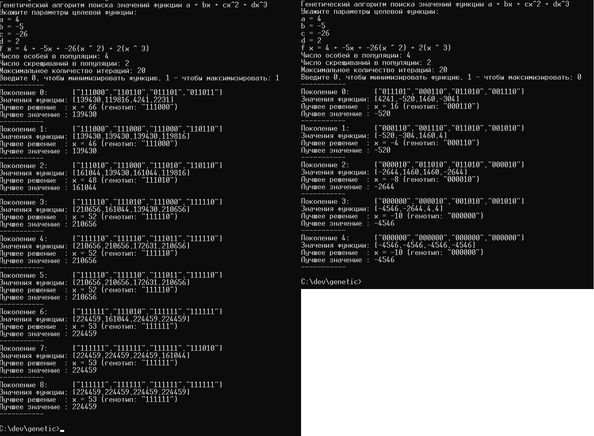

# genetic

### Описание

Генетический алгоритм поиска минимального/максимального значения функции `a + bx + cx^2 + dx^3` на отрезке `[-10; 53]`.

### Параметры алгоритма

- **создание исходной популяции**: выбор случайных значений, принадлежащих заданному отрезку;
- **тип отбора родительских особей**: панмиксия (при этом каждая особь входит в каждую пару не более 1 раза); 
- **тип скрещивания**: одноточечный кроссовер;
- **тип мутации**: инверсия случайного бита;
- **вероятность мутации**: 0.45 для каждого потомка;
- **стратегия отбора**: метод рулетки + элитарная стратегия.

Алгоритм завершает работу, если достигнуто максимальное количество итераций или если все особи в текущей популяции одинаковы.

### Использование

При запуске программы необходимо указать следующие параметры:

- параметры целевой функции `a, b, c, d`;
- число особей в популяции;
- число скрещиваний в каждой популяции;
- максимальное количество итераций;
- режим поиска: поиск минимума (`0`) или поиск максимума (`1`).

### Примеры работы алгоритма

Минимизация функции `67 + 3x - 66x^2 + x^3` с 6 особями в популяции и 3 скрещиваниями:

Алгоритм завершает работу за 11 итераций, т. к. на 11 итерации получена однообразная популяция. Лучшее решение (`x = 44; f(x) = -42393)` соответствует реальному минимуму функции на заданном отрезке.

---

Максимизация функции `67 + 3x - 66x^2 + x^3` с теми же параметрами:

Поиск завершается после прохождения 20 итераций. Лучшее решение (`x = 0; f(x) = 67)` соответствует максимальному значению функции на заданном отрезке.

---

Максимизация и минимизация функции `4 - 5x - 26x^2 + 2x^3` с 4 особями в популяции и 2 скрещиваниями:
